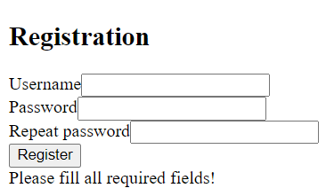

# **PHP User Login and Registration System**

A simple PHP-based system for user registration, login, and logout using MySQL for data storage. Ideal for students and beginners learning web development and authentication techniques.

---

## **Features**
- Secure user registration with password hashing.
- Login and logout functionality with session management.
- Input validation to prevent common errors.
- Easy-to-set-up database and code structure.

---

## **Technologies Used**
- **PHP**: Backend logic.
- **MySQL**: Database for storing user credentials.
- **HTML**: Frontend for forms and navigation.
- **JavaScript (optional)**: Enhancing interactivity.

---

## **Getting Started**

### **Prerequisites**
1. A web server with PHP and MySQL support. Recommended:
   - [XAMPP](https://www.apachefriends.org/) (Windows/macOS/Linux)
   - [WAMP](https://www.wampserver.com/) (Windows)
   - [MAMP](https://www.mamp.info/) (macOS/Windows)

2. Basic knowledge of PHP and MySQL.

---

### **Installation**

1. **Download the Project**
   - Clone the repository or download it as a ZIP file and extract it.

   ```bash
   git clone https://github.com/yourusername/php-user-system.git
   cd php-user-system
   ```

2. **Set Up the Database**
   - Open `http://localhost/phpmyadmin` in your browser.
   - Create a database named `database` (or any name you prefer).
   - Import the provided `database.sql` file:
     - Click **Import**.
     - Select `database.sql` from your local directory.
     - Click **Go**.

3. **Configure the Application**
   - Open the `head.php` file.
   - Update the database connection details if needed:
     ```php
     $conn = new mysqli('localhost', 'root', '', 'database', 3306);
     ```
     - **localhost**: Database host.
     - **root**: Default username for MySQL.
     - **''**: Default password (leave blank unless you’ve set a MySQL password).

4. **Place the Files in the Server Directory**
   - Move the project files into your server’s root directory:
     - For **XAMPP**: `C:/xampp/htdocs/php-user-system/`
     - For **WAMP**: `C:/wamp64/www/php-user-system/`
     - For **MAMP**: `/Applications/MAMP/htdocs/php-user-system/`

5. **Start the Server**
   - Launch Apache and MySQL services using your server control panel.
   - Open your browser and navigate to:
     ```
     http://localhost/php-user-system/
     ```

---

## **Usage**

1. **Registration**
   - Fill in the username, password, and repeat password fields.
   - Submit the form to create an account.

2. **Login**
   - Enter your registered username and password.
   - Successfully logging in will redirect you to the homepage.

3. **Logout**
   - Click the `Logout` link to end the session and return to the homepage.

---

## **Screenshots**

### Home Page (Index)


### Registration Page


### Registration Error - Please Fill All Fields


### Registration Error - Username Taken
! [Username Taken](images/registration_error_username.png)

### Registration Error - Passwords Do Not Match
! [Registration Error - Passwords Do Not Match](images/registration_error_password.png)

### Login Page


### Login Error


### Authenticated Home Page


---

## **Security Tips**
1. Use HTTPS in production to secure data transmission.
2. Replace raw SQL queries with prepared statements for enhanced security.
3. Enforce strong password policies (e.g., minimum length, complexity).

---

## **Contributing**
Feel free to submit pull requests or issues to improve the project.

---

## **License**
This project is licensed under the MIT License.

---

## **Author**
**Zdravko Brdarovski**
